# Gas Leak Detector — Block Diagram Documentation

> **Visual system architecture using Mermaid diagrams**

---

## 📦 System Block Diagram

### High-Level Architecture

---

## 🔌 Hardware Component Block Diagram

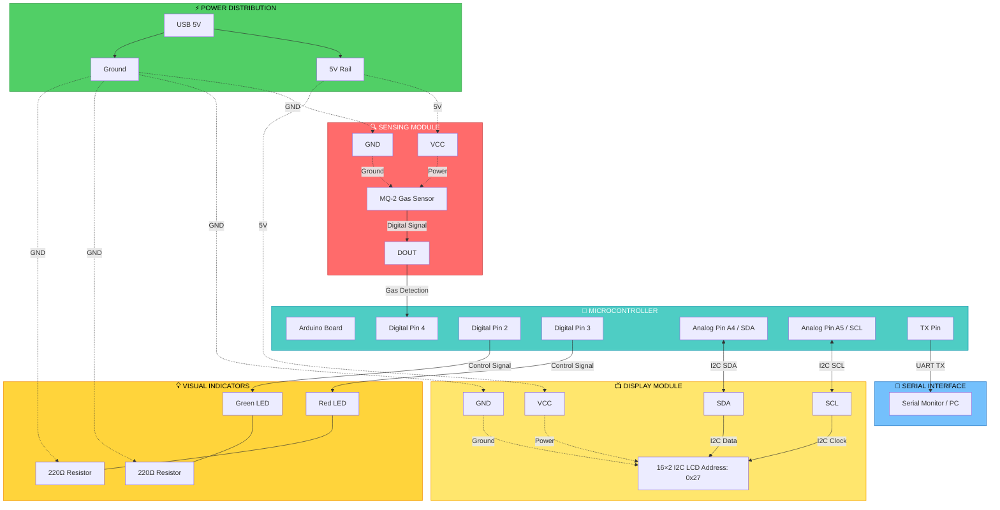

---

## 🔄 Data Flow Architecture

```mermaid
graph LR
  subgraph Input["INPUT STAGE"]
    direction TB
    A1[Air Sample]
    A2[MQ-2 Chemiresistor]
    A3[Analog-to-Digital Comparator]
    A4[Digital Signal HIGH/LOW]

    A1 --> A2
    A2 -->|Resistance Change| A3
    A3 --> A4
  end

  subgraph Processing["PROCESSING STAGE"]
    direction TB
    B1[digitalRead Pin 4]
    B2[Debounce Filter 500ms window]
    B3[Threshold Counter 3 consecutive reads]
    B4{State Decision}

    B1 --> B2
    B2 --> B3
    B3 --> B4
  end

  subgraph Output["OUTPUT STAGE"]
    direction TB
    C1[LED Control Pins 2 & 3]
    C2[LCD Update I2C Protocol]
    C3[Serial Logging UART 9600]

    C1 & C2 & C3
  end

  A4 -->|Digital Value| B1
  B4 -->|Safe State| Output
  B4 -->|Danger State| Output

  style Input fill:#ff6b6b,stroke:#c92a2a,color:#fff
  style Processing fill:#4ecdc4,stroke:#099268,color:#fff
  style Output fill:#ffe66d,stroke:#f59f00,color:#000
```

---

## ⚙️ Functional Block Diagram

---

## 🧠 Processing Pipeline

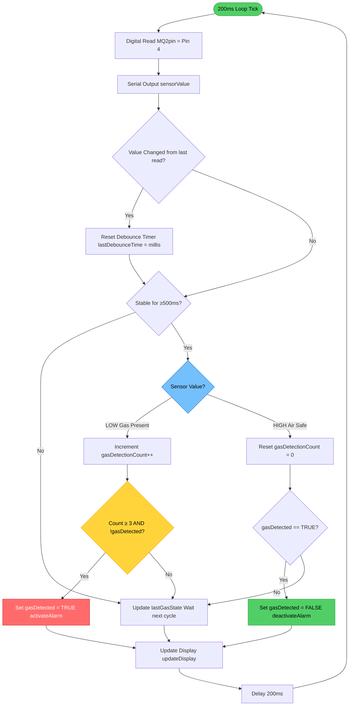

---

## 🎛️ I2C Communication Block

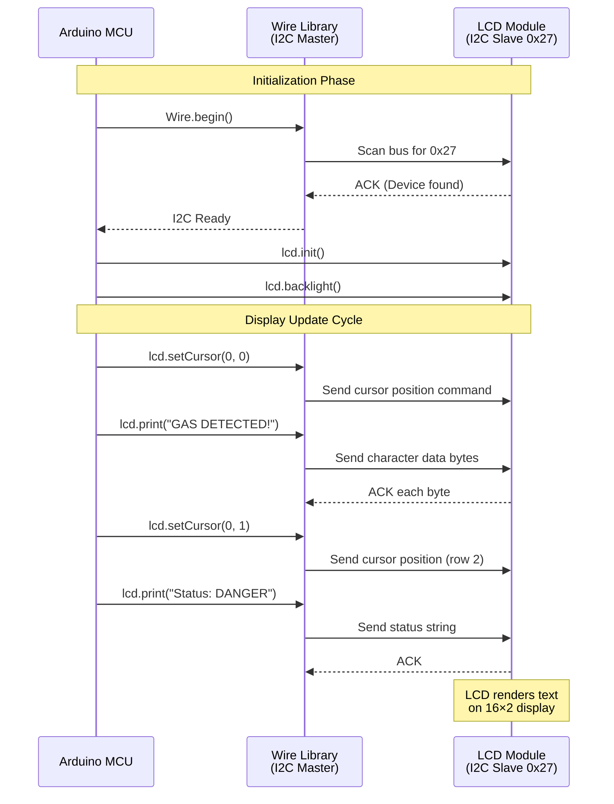

---

## 🔐 Safety Logic Block

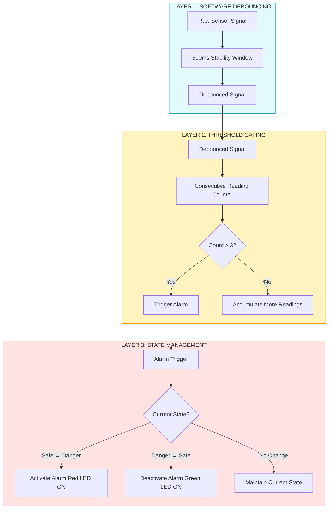

---

## 📊 Pin Assignment Diagram

```mermaid
block-beta
  columns 5

  block:Digital["DIGITAL PINS"]:2
    Pin0["Pin 0 RX (Serial)"]
    Pin1["Pin 1 TX (Serial)"]
    Pin2["Pin 2 ✅ Green LED"]
    Pin3["Pin 3 🚨 Red LED"]
    Pin4["Pin 4 🔍 MQ-2 DOUT"]
    Pin5["Pin 5-13 Unused"]
  end

  space

  block:Analog["ANALOG PINS"]:2
    A0["A0-A3 Unused"]
    A4["A4 (SDA) 💬 I2C Data"]
    A5["A5 (SCL) ⏱️ I2C Clock"]
  end

  block:Power["POWER PINS"]:1
    VCC["5V Power Rail"]
    space
    GND["GND Ground"]
    space
    Vin["Vin USB/External"]
  end

  style Digital fill:#4ecdc4,stroke:#1098ad,color:#fff
  style Analog fill:#ffe66d,stroke:#f59f00,color:#000
  style Power fill:#51cf66,stroke:#2f9e44,color:#000
```

---

## 🔬 MQ-2 Sensor Functional Block

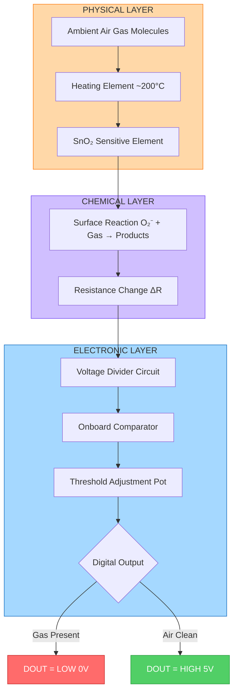

---

## 🧮 Memory & Resource Allocation

---

## 📈 Timing Diagram

```mermaid
%%{init: {'theme':'base', 'themeVariables': { 'primaryColor':'#4ecdc4'}}}%%
gantt
    title Gas Detection Timing Analysis
    dateFormat X
    axisFormat %L ms

    section Sensor Reading
    Loop Iteration 1 :a1, 0, 200
    Loop Iteration 2 :a2, 200, 400
    Loop Iteration 3 :a3, 400, 600
    Loop Iteration 4 :a4, 600, 800

    section Debounce Window
    Gas Spike (ignored) :crit, 50, 100
    Stable Reading Starts :milestone, 200, 0
    500ms Debounce Period :active, 200, 700
    Reading Validated :milestone, 700, 0

    section Detection Counter
    Count = 1 :b1, 200, 400
    Count = 2 :b2, 400, 600
    Count = 3 (ALARM) :crit, 600, 800

    section LED/LCD Response
    Green LED ON :active, 0, 600
    Red LED ON :crit, 600, 800
    LCD Update :milestone, 650, 50
```

---

## 🎯 State Transition Timing

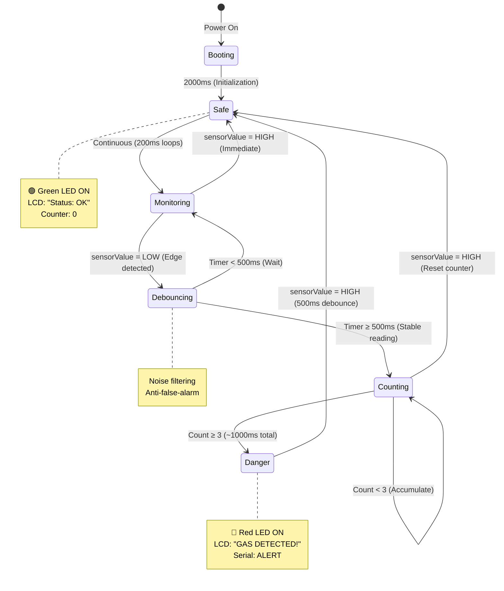

---

## 🛠️ System Configuration Matrix

| **Component**       | **Parameter**     | **Value**      | **Tunable?** | **Impact**            |
| ------------------- | ----------------- | -------------- | ------------ | --------------------- |
| **MQ-2 Sensor**     | Operating Voltage | 5V DC          | ❌ No        | Fixed by hardware     |
|                     | Heating Current   | ~150 mA        | ❌ No        | Internal heater       |
|                     | Digital Threshold | Pot-adjustable | ✅ Yes       | Detection sensitivity |
|                     | Warm-up Time      | 24-48 hours    | ❌ No        | Initial calibration   |
| **Detection Logic** | Debounce Delay    | 500ms          | ✅ Yes       | False alarm rate      |
|                     | Alarm Threshold   | 3 readings     | ✅ Yes       | Response time         |
|                     | Sampling Rate     | 200ms (5 Hz)   | ✅ Yes       | Processing load       |
| **I2C LCD**         | Bus Address       | 0x27           | ⚠️ Maybe     | Hardware-dependent    |
|                     | Update Rate       | ~50ms/char     | ❌ No        | Library limitation    |
| **Serial**          | Baud Rate         | 9600 bps       | ✅ Yes       | Logging speed         |
| **LEDs**            | Current Limit     | ~20 mA         | ⚠️ Maybe     | Resistor value        |

---

## 📐 Physical Layout Recommendation

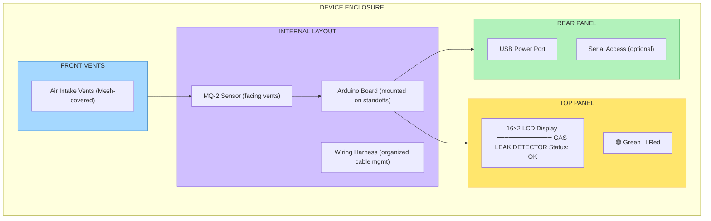

---

## 🧩 Integration Architecture

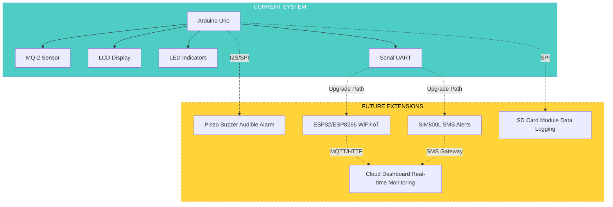

---

## 📝 Summary

This block diagram documentation provides:

✅ **Hardware architecture** — Component connectivity and pin assignments
✅ **Data flow** — Signal processing from sensor to output
✅ **Processing pipeline** — Step-by-step logic execution
✅ **Timing analysis** — Response times and debounce windows
✅ **Safety logic** — Multi-layer false-alarm protection
✅ **Integration options** — Future expansion possibilities

**Related Documentation:**

- [README.md](README.md) — Complete technical documentation
- [SIMPLE.md](SIMPLE.md) — Quick reference guide
- [arduino.ino](arduino.ino) — Source code implementation

---

**Built with clarity for learning and design reference**
