# Gas Leak Detector — Block Diagram Documentation

> **Visual system architecture using Mermaid diagrams**

---

## 📦 System Block Diagram

### High-Level Architecture

```mermaid
block-beta
  columns 3

  block:Sensors["SENSOR LAYER"]:1
    MQ2["MQ-2 Gas Sensor\n(Digital Pin 4)"]
  end

  block:Controller["CONTROL LAYER"]:1
    Arduino["Arduino Uno/Nano\n• ATmega328P\n• 16 MHz\n• 5V Logic"]
    space
    Logic["Detection Logic\n• Debouncing\n• Threshold Check\n• State Machine"]
  end

  block:Output["OUTPUT LAYER"]:1
    Visual["Visual Alerts\n━━━━━━━━\nGreen LED (Pin 2)\nRed LED (Pin 3)\nLCD Display (I2C)"]
    space
    Serial["Serial UART\n━━━━━━━━\n9600 baud\nLogging/Monitor"]
  end

  MQ2 --> Arduino
  Arduino --> Logic
  Logic --> Visual
  Logic --> Serial

  style Sensors fill:#ff6b6b,stroke:#c92a2a,color:#fff
  style Controller fill:#4ecdc4,stroke:#099268,color:#fff
  style Output fill:#ffe66d,stroke:#f59f00,color:#000
```

---

## 🔌 Hardware Component Block Diagram

```mermaid
graph TB
  subgraph Power["⚡ POWER DISTRIBUTION"]
    USB[USB 5V]
    VCC[5V Rail]
    GND[Ground]

    USB --> VCC
    USB --> GND
  end

  subgraph Sensing["🔍 SENSING MODULE"]
    MQ2[MQ-2 Gas Sensor]
    MQ2_VCC[VCC]
    MQ2_GND[GND]
    MQ2_DOUT[DOUT]

    MQ2_VCC -.->|Power| MQ2
    MQ2_GND -.->|Ground| MQ2
    MQ2 -->|Digital Signal| MQ2_DOUT
  end

  subgraph MCU["🧠 MICROCONTROLLER"]
    Arduino[Arduino Board]
    Pin4[Digital Pin 4]
    Pin2[Digital Pin 2]
    Pin3[Digital Pin 3]
    A4[Analog Pin A4 / SDA]
    A5[Analog Pin A5 / SCL]
    TX[TX Pin]
  end

  subgraph Display["📺 DISPLAY MODULE"]
    LCD[16×2 I2C LCD\nAddress: 0x27]
    LCD_SDA[SDA]
    LCD_SCL[SCL]
    LCD_VCC[VCC]
    LCD_GND[GND]

    LCD_SDA -->|I2C Data| LCD
    LCD_SCL -->|I2C Clock| LCD
    LCD_VCC -.->|Power| LCD
    LCD_GND -.->|Ground| LCD
  end

  subgraph Indicators["💡 VISUAL INDICATORS"]
    GreenLED[Green LED]
    R1[220Ω Resistor]
    RedLED[Red LED]
    R2[220Ω Resistor]

    GreenLED --- R1
    RedLED --- R2
  end

  subgraph Communication["📡 SERIAL INTERFACE"]
    SerialPort[Serial Monitor / PC]
  end

  %% Power connections
  VCC -.->|5V| MQ2_VCC
  VCC -.->|5V| LCD_VCC
  GND -.->|GND| MQ2_GND
  GND -.->|GND| LCD_GND
  GND -.->|GND| R1
  GND -.->|GND| R2

  %% Signal connections
  MQ2_DOUT -->|Gas Detection| Pin4
  Pin2 -->|Control Signal| GreenLED
  Pin3 -->|Control Signal| RedLED
  A4 <-->|I2C SDA| LCD_SDA
  A5 <-->|I2C SCL| LCD_SCL
  TX -->|UART TX| SerialPort

  style Power fill:#51cf66,stroke:#2f9e44,color:#000
  style Sensing fill:#ff6b6b,stroke:#c92a2a,color:#fff
  style MCU fill:#4ecdc4,stroke:#1098ad,color:#fff
  style Display fill:#ffe66d,stroke:#f59f00,color:#000
  style Indicators fill:#ffd43b,stroke:#f08c00,color:#000
  style Communication fill:#74c0fc,stroke:#1971c2,color:#000
```

---

## 🔄 Data Flow Architecture

```mermaid
graph LR
  subgraph Input["INPUT STAGE"]
    direction TB
    A1[Air Sample]
    A2[MQ-2 Chemiresistor]
    A3[Analog-to-Digital\nComparator]
    A4[Digital Signal\nHIGH/LOW]

    A1 --> A2
    A2 -->|Resistance Change| A3
    A3 --> A4
  end

  subgraph Processing["PROCESSING STAGE"]
    direction TB
    B1[digitalRead Pin 4]
    B2[Debounce Filter\n500ms window]
    B3[Threshold Counter\n3 consecutive reads]
    B4{State Decision}

    B1 --> B2
    B2 --> B3
    B3 --> B4
  end

  subgraph Output["OUTPUT STAGE"]
    direction TB
    C1[LED Control\nPins 2 & 3]
    C2[LCD Update\nI2C Protocol]
    C3[Serial Logging\nUART 9600]

    C1 & C2 & C3
  end

  A4 -->|Digital Value| B1
  B4 -->|Safe State| Output
  B4 -->|Danger State| Output

  style Input fill:#ff6b6b,stroke:#c92a2a,color:#fff
  style Processing fill:#4ecdc4,stroke:#099268,color:#fff
  style Output fill:#ffe66d,stroke:#f59f00,color:#000
```

---

## ⚙️ Functional Block Diagram

```mermaid
block-beta
  columns 4

  block:SensorBlock["SENSOR INTERFACE"]:1
    MQSensor["MQ-2 Sensor\n━━━━━━━━\n• SnO2 Element\n• Heater Circuit\n• Comparator\n• Digital Output"]
  end

  block:InputProcessing["INPUT PROCESSING"]:1
    DigitalRead["digitalRead()\n━━━━━━━━\nPin 4\nMode: INPUT"]
    space
    SerialLog["Serial Write\n━━━━━━━━\nLog raw value\n9600 baud"]
  end

  block:SafetyLogic["SAFETY LOGIC"]:1
    Debounce["Debounce Module\n━━━━━━━━\n• Timer: 500ms\n• State tracking\n• Edge detection"]
    space
    Threshold["Threshold Gate\n━━━━━━━━\n• Counter: 0-3\n• Auto-reset\n• Alarm trigger"]
  end

  block:ActionLayer["ACTION LAYER"]:1
    Alarm["Alarm Control\n━━━━━━━━\nactivateAlarm()\ndeactivateAlarm()"]
    space
    Display["Display Manager\n━━━━━━━━\nupdateDisplay()\nAnti-flicker"]
  end

  MQSensor --> DigitalRead
  DigitalRead --> SerialLog
  DigitalRead --> Debounce
  Debounce --> Threshold
  Threshold --> Alarm
  Alarm --> Display

  style SensorBlock fill:#ff8787,stroke:#c92a2a
  style InputProcessing fill:#69db7c,stroke:#2f9e44
  style SafetyLogic fill:#74c0fc,stroke:#1971c2
  style ActionLayer fill:#ffd43b,stroke:#f59f00
```

---

## 🧠 Processing Pipeline

```mermaid
graph TD
  Start([200ms Loop Tick]) --> Read[Digital Read\nMQ2pin = Pin 4]

  Read --> Log[Serial Output\nsensorValue]

  Log --> EdgeDetect{Value Changed\nfrom last read?}

  EdgeDetect -->|Yes| ResetTimer[Reset Debounce Timer\nlastDebounceTime = millis]
  EdgeDetect -->|No| CheckStable

  ResetTimer --> CheckStable{Stable for\n≥500ms?}

  CheckStable -->|No| UpdateState[Update lastGasState\nWait next cycle]
  CheckStable -->|Yes| CheckValue{Sensor\nValue?}

  CheckValue -->|LOW\nGas Present| Increment[Increment\ngasDetectionCount++]
  CheckValue -->|HIGH\nAir Safe| Reset[Reset\ngasDetectionCount = 0]

  Increment --> ThresholdCheck{Count ≥ 3\nAND\n!gasDetected?}
  ThresholdCheck -->|Yes| Activate[Set gasDetected = TRUE\nactivateAlarm]
  ThresholdCheck -->|No| UpdateState

  Reset --> AlarmCheck{gasDetected\n== TRUE?}
  AlarmCheck -->|Yes| Deactivate[Set gasDetected = FALSE\ndeactivateAlarm]
  AlarmCheck -->|No| UpdateState

  Activate --> UpdateDisplay[Update Display\nupdateDisplay]
  Deactivate --> UpdateDisplay
  UpdateState --> UpdateDisplay

  UpdateDisplay --> Delay[Delay 200ms]
  Delay --> Start

  style Start fill:#51cf66,stroke:#2f9e44,color:#000
  style Activate fill:#ff6b6b,stroke:#c92a2a,color:#fff
  style Deactivate fill:#51cf66,stroke:#2f9e44,color:#000
  style ThresholdCheck fill:#ffd43b,stroke:#f59f00,color:#000
  style CheckValue fill:#74c0fc,stroke:#1971c2,color:#000
```

---

## 🎛️ I2C Communication Block

---

## 🔐 Safety Logic Block

```mermaid
graph TB
  subgraph Layer1["LAYER 1: SOFTWARE DEBOUNCING"]
    direction LR
    Input1[Raw Sensor\nSignal] --> Timer[500ms Stability\nWindow]
    Timer --> Output1[Debounced\nSignal]
  end

  subgraph Layer2["LAYER 2: THRESHOLD GATING"]
    direction LR
    Input2[Debounced\nSignal] --> Counter[Consecutive\nReading Counter]
    Counter --> Gate{Count ≥ 3?}
    Gate -->|Yes| Output2[Trigger\nAlarm]
    Gate -->|No| Wait[Accumulate\nMore Readings]
  end

  subgraph Layer3["LAYER 3: STATE MANAGEMENT"]
    direction LR
    Input3[Alarm\nTrigger] --> StateMachine{Current\nState?}
    StateMachine -->|Safe → Danger| Activate[Activate Alarm\nRed LED ON]
    StateMachine -->|Danger → Safe| Deactivate[Deactivate Alarm\nGreen LED ON]
    StateMachine -->|No Change| Maintain[Maintain\nCurrent State]
  end

  Output1 --> Input2
  Output2 --> Input3

  style Layer1 fill:#e3fafc,stroke:#1098ad
  style Layer2 fill:#fff3bf,stroke:#f59f00
  style Layer3 fill:#ffe3e3,stroke:#c92a2a
```

---

## 📊 Pin Assignment Diagram

```mermaid
block-beta
  columns 5

  block:Digital["DIGITAL PINS"]:2
    Pin0["Pin 0\nRX (Serial)"]
    Pin1["Pin 1\nTX (Serial)"]
    Pin2["Pin 2\n✅ Green LED"]
    Pin3["Pin 3\n🚨 Red LED"]
    Pin4["Pin 4\n🔍 MQ-2 DOUT"]
    Pin5["Pin 5-13\nUnused"]
  end

  space

  block:Analog["ANALOG PINS"]:2
    A0["A0-A3\nUnused"]
    A4["A4 (SDA)\n💬 I2C Data"]
    A5["A5 (SCL)\n⏱️ I2C Clock"]
  end

  block:Power["POWER PINS"]:1
    VCC["5V\nPower Rail"]
    space
    GND["GND\nGround"]
    space
    Vin["Vin\nUSB/External"]
  end

  style Digital fill:#4ecdc4,stroke:#1098ad,color:#fff
  style Analog fill:#ffe66d,stroke:#f59f00,color:#000
  style Power fill:#51cf66,stroke:#2f9e44,color:#000
```

---

## 🔬 MQ-2 Sensor Functional Block

```mermaid
graph TB
  subgraph Physical["PHYSICAL LAYER"]
    Air[Ambient Air\nGas Molecules] --> Heater[Heating Element\n~200°C]
    Heater --> Element[SnO₂ Sensitive\nElement]
  end

  subgraph Chemical["CHEMICAL LAYER"]
    Element --> Reaction[Surface Reaction\nO₂⁻ + Gas → Products]
    Reaction --> Resistance[Resistance\nChange ΔR]
  end

  subgraph Electronic["ELECTRONIC LAYER"]
    Resistance --> Divider[Voltage Divider\nCircuit]
    Divider --> Comparator[Onboard\nComparator]
    Comparator --> Potentiometer[Threshold\nAdjustment Pot]
    Potentiometer --> Output{Digital\nOutput}
  end

  Output -->|Gas Present| LOW[DOUT = LOW\n0V]
  Output -->|Air Clean| HIGH[DOUT = HIGH\n5V]

  style Physical fill:#ffd8a8,stroke:#fd7e14
  style Chemical fill:#d0bfff,stroke:#7950f2
  style Electronic fill:#a5d8ff,stroke:#1971c2
  style LOW fill:#ff6b6b,stroke:#c92a2a,color:#fff
  style HIGH fill:#51cf66,stroke:#2f9e44,color:#fff
```

---

## 🧮 Memory & Resource Allocation

```mermaid
block-beta
  columns 3

  block:SRAM["SRAM (2KB)"]:1
    GlobalVars["Global Variables\n━━━━━━━━\n• sensorValue: int\n• gasDetected: bool\n• lastGasState: bool\n• lastDebounceTime: ulong\n• debounceDelay: ulong\n• alarmThreshold: int\n• gasDetectionCount: int\n~28 bytes"]
    space
    LCD_Buffer["LCD Library\nBuffer\n~100 bytes"]
    space
    Stack["Stack/Heap\n~1.8KB free"]
  end

  block:Flash["Flash (32KB)"]:1
    Code["Program Code\n━━━━━━━━\n• Main logic\n• Functions\n~4-6 KB"]
    space
    Libraries["Libraries\n━━━━━━━━\n• Wire.h\n• LiquidCrystal_I2C\n~8-10 KB"]
    space
    Bootloader["Bootloader\n━━━━━━━━\n0.5 KB reserved"]
  end

  block:EEPROM["EEPROM (1KB)"]:1
    Unused["Unused\n━━━━━━━━\nAvailable for\nconfig storage\nor calibration\ndata"]
  end

  style SRAM fill:#a5d8ff,stroke:#1971c2
  style Flash fill:#ffd8a8,stroke:#fd7e14
  style EEPROM fill:#d0bfff,stroke:#7950f2
```

---

## 📈 Timing Diagram

---

## 🎯 State Transition Timing

```mermaid
stateDiagram-v2
    [*] --> Booting: Power On

    Booting --> Safe: 2000ms\n(Initialization)

    Safe --> Monitoring: Continuous\n(200ms loops)

    Monitoring --> Safe: sensorValue = HIGH\n(Immediate)

    Monitoring --> Debouncing: sensorValue = LOW\n(Edge detected)

    Debouncing --> Monitoring: Timer < 500ms\n(Wait)

    Debouncing --> Counting: Timer ≥ 500ms\n(Stable reading)

    Counting --> Safe: sensorValue = HIGH\n(Reset counter)

    Counting --> Counting: Count < 3\n(Accumulate)

    Counting --> Danger: Count ≥ 3\n(~1000ms total)

    Danger --> Safe: sensorValue = HIGH\n(500ms debounce)

    note right of Safe
        🟢 Green LED ON
        LCD: "Status: OK"
        Counter: 0
    end note

    note right of Danger
        🔴 Red LED ON
        LCD: "GAS DETECTED!"
        Serial: ALERT
    end note

    note right of Debouncing
        Noise filtering
        Anti-false-alarm
    end note
```

---

## 🛠️ System Configuration Matrix

| **Component** | **Parameter** | **Value** | **Tunable?** | **Impact** |
|---------------|---------------|-----------|--------------|------------|
| **MQ-2 Sensor** | Operating Voltage | 5V DC | ❌ No | Fixed by hardware |
| | Heating Current | ~150 mA | ❌ No | Internal heater |
| | Digital Threshold | Pot-adjustable | ✅ Yes | Detection sensitivity |
| | Warm-up Time | 24-48 hours | ❌ No | Initial calibration |
| **Detection Logic** | Debounce Delay | 500ms | ✅ Yes | False alarm rate |
| | Alarm Threshold | 3 readings | ✅ Yes | Response time |
| | Sampling Rate | 200ms (5 Hz) | ✅ Yes | Processing load |
| **I2C LCD** | Bus Address | 0x27 | ⚠️ Maybe | Hardware-dependent |
| | Update Rate | ~50ms/char | ❌ No | Library limitation |
| **Serial** | Baud Rate | 9600 bps | ✅ Yes | Logging speed |
| **LEDs** | Current Limit | ~20 mA | ⚠️ Maybe | Resistor value |

---

## 📐 Physical Layout Recommendation

```mermaid
graph TB
  subgraph Enclosure["DEVICE ENCLOSURE"]
    direction LR

    subgraph Top["TOP PANEL"]
      LCD_Display["16×2 LCD Display\n━━━━━━━━━━━━━━\nGAS LEAK DETECTOR\nStatus: OK"]
      LED_Array["🟢 Green  🔴 Red"]
    end

    subgraph Front["FRONT VENTS"]
      Vents["Air Intake Vents\n(Mesh-covered)"]
    end

    subgraph Internal["INTERNAL LAYOUT"]
      direction TB
      Arduino_Mount["Arduino Board\n(mounted on standoffs)"]
      Sensor_Mount["MQ-2 Sensor\n(facing vents)"]
      Wiring["Wiring Harness\n(organized cable mgmt)"]
    end

    subgraph Rear["REAR PANEL"]
      USB_Port["USB Power Port"]
      Serial_Access["Serial Access\n(optional)"]
    end
  end

  Front --> Sensor_Mount
  Sensor_Mount --> Arduino_Mount
  Arduino_Mount --> Top
  Arduino_Mount --> Rear

  style Top fill:#ffe66d,stroke:#f59f00
  style Front fill:#a5d8ff,stroke:#1971c2
  style Internal fill:#d0bfff,stroke:#7950f2
  style Rear fill:#b2f2bb,stroke:#2f9e44
```

---

## 🧩 Integration Architecture

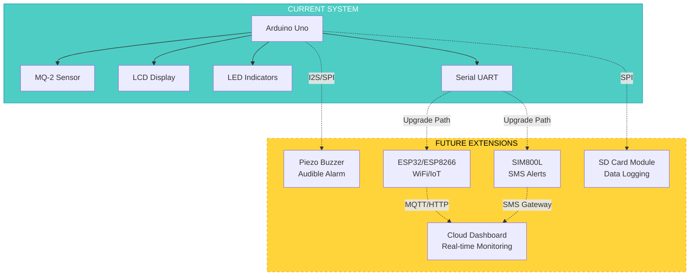

---

## 📝 Summary

This block diagram documentation provides:

✅ **Hardware architecture** — Component connectivity and pin assignments
✅ **Data flow** — Signal processing from sensor to output
✅ **Processing pipeline** — Step-by-step logic execution
✅ **Timing analysis** — Response times and debounce windows
✅ **Safety logic** — Multi-layer false-alarm protection
✅ **Integration options** — Future expansion possibilities

**Related Documentation:**
- [README.md](README.md) — Complete technical documentation
- [SIMPLE.md](SIMPLE.md) — Quick reference guide
- [arduino.ino](arduino.ino) — Source code implementation

---

**Built with clarity for learning and design reference**
