# Gas Leak Detector System

> **Real-time gas detection system using MQ-2 sensor with visual/audio feedback and LCD display**


---

## 🎯 Overview

A robust gas leak detection system designed for safety monitoring in residential or industrial environments. The system uses an MQ-2 gas sensor to detect combustible gases (LPG, propane, methane, hydrogen) and provides immediate visual/audible alerts through LCD display, LED indicators, and serial communication.

### Key Features

- ✅ **Multi-threshold detection** with debouncing for false-positive prevention
- ✅ **Real-time monitoring** with 200ms sampling rate
- ✅ **Visual feedback** via dual LED indicators (green = safe, red = danger)
- ✅ **LCD display** for status messages and live readings
- ✅ **Serial logging** for remote monitoring and debugging
- ✅ **Anti-flicker protection** for stable display updates

---

## 🔧 Hardware Components

| Component           | Model/Type       | Pin           | Purpose                                        |
| ------------------- | ---------------- | ------------- | ---------------------------------------------- |
| **Gas Sensor**      | MQ-2             | Digital Pin 4 | Detects combustible gases (LOW = gas detected) |
| **LCD Display**     | 16×2 I2C (0x27)  | SDA/SCL       | Real-time status display                       |
| **Green LED**       | 5mm LED          | Digital Pin 2 | Safe state indicator                           |
| **Red LED**         | 5mm LED          | Digital Pin 3 | Danger state indicator                         |
| **Microcontroller** | Arduino Uno/Nano | —             | Main control unit                              |

---

## 📐 System Architecture


---

## 🔄 State Machine Diagram

```mermaid
stateDiagram-v2
    [*] --> Initializing
    Initializing --> Safe: Setup Complete

    Safe --> Detecting: Gas Reading = LOW
    Detecting --> Safe: Gas Reading = HIGH
    Detecting --> Danger: Detection Count ≥ 3

    Danger --> Safe: Gas Reading = HIGH (Debounced)

    Safe: Green LED ON\nLCD: "Status: OK"\nSerial: Normal

    Detecting: Accumulating Readings\nDebounce Active

    Danger: Red LED ON\nLCD: "GAS DETECTED!"\nSerial: ALERT
```



---

## ⚙️ Detection Logic Flow


---

## 📋 Pseudologic

### Main Control Loop

```plaintext
INITIALIZE:
  SET serial_baud_rate = 9600
  CONFIGURE pins [greenLED=2, redLED=3, MQ2sensor=4]
  INITIALIZE lcd_display with I2C address 0x27
  DISPLAY "Gas Leak Detect" and "Health: OK"
  TURN ON greenLED, TURN OFF redLED
  WAIT 2 seconds

LOOP:
  // ──────────────────────────────────
  // STEP 1: Sensor Reading
  // ──────────────────────────────────
  READ sensorValue FROM MQ2pin (digital)
  SEND sensorValue TO serial_monitor

  // ──────────────────────────────────
  // STEP 2: Debounce Check
  // ──────────────────────────────────
  IF sensorValue ≠ lastGasState THEN
    SET lastDebounceTime = current_time
  END IF

  IF (current_time - lastDebounceTime) > 500ms THEN
    // Reading is stable; process it

    // ──────────────────────────────────
    // STEP 3A: Gas Detection Path
    // ──────────────────────────────────
    IF sensorValue == LOW THEN  // MQ-2 outputs LOW when gas present
      INCREMENT gasDetectionCount

      IF gasDetectionCount >= 3 AND NOT gasDetected THEN
        SET gasDetected = TRUE
        CALL activateAlarm()
      END IF

    // ──────────────────────────────────
    // STEP 3B: Safe State Path
    // ──────────────────────────────────
    ELSE IF sensorValue == HIGH THEN  // Sensor reads HIGH when safe
      SET gasDetectionCount = 0

      IF gasDetected == TRUE THEN
        SET gasDetected = FALSE
        CALL deactivateAlarm()
      END IF
    END IF
  END IF

  // ──────────────────────────────────
  // STEP 4: Update State & Display
  // ──────────────────────────────────
  SET lastGasState = sensorValue
  CALL updateDisplay()

  DELAY 200ms
END LOOP

// ══════════════════════════════════════════
// FUNCTION: activateAlarm
// ══════════════════════════════════════════
FUNCTION activateAlarm():
  TURN ON redLED
  TURN OFF greenLED

  CLEAR lcd_display
  PRINT "GAS DETECTED!" on row 0
  PRINT "Status: DANGER" on row 1

  SEND "ALERT: Gas leak detected!" TO serial_monitor
END FUNCTION

// ══════════════════════════════════════════
// FUNCTION: deactivateAlarm
// ══════════════════════════════════════════
FUNCTION deactivateAlarm():
  TURN ON greenLED
  TURN OFF redLED

  CLEAR lcd_display
  PRINT "GAS LEVEL" on row 0
  PRINT "Status: OK" on row 1

  SEND "Gas levels normal" TO serial_monitor
END FUNCTION

// ══════════════════════════════════════════
// FUNCTION: updateDisplay (anti-flicker)
// ══════════════════════════════════════════
FUNCTION updateDisplay():
  IF NOT gasDetected THEN
    SET cursor to column 12, row 1
    IF sensorValue == HIGH THEN
      PRINT "  " (clear indicator)
    ELSE
      PRINT "CHK" (checking indicator)
    END IF
  END IF
END FUNCTION
```

---

## 🧪 Threshold & Debounce Strategy

The system employs a **two-layer protection mechanism** to prevent false alarms:

### 1. Software Debouncing (500ms)

```plaintext
IF sensor_reading_changes THEN
  wait_500ms_for_stable_signal
END IF
```

### 2. Consecutive Reading Threshold (3 readings)

```plaintext
REQUIRE 3_consecutive_LOW_readings BEFORE alarm_activation
RESET counter_immediately ON any_HIGH_reading
```

**Why this matters:**

- ⚡ Eliminates electrical noise and transient spikes
- 🛡️ Requires sustained gas presence before triggering alarm
- 🎯 Reduces false positives from environmental interference

---

## 🚀 Getting Started

### Prerequisites

```bash
# Arduino IDE 2.x or Platform IO
# Required Libraries (install via Library Manager)
```

**Library Dependencies:**

- `Wire.h` (I2C communication) — Built-in
- `LiquidCrystal_I2C.h` — [GitHub Link](https://github.com/johnrickman/LiquidCrystal_I2C)

### Installation

1. **Clone/Download** this repository:

   ```bash
   git clone https://github.com/yourusername/gas-leak-detector.git
   cd gas-leak-detector
   ```

2. **Install Libraries:**

   - Open Arduino IDE
   - Navigate to `Sketch > Include Library > Manage Libraries`
   - Search for "LiquidCrystal I2C" and install

3. **Configure I2C Address** (if needed):

   ```cpp
   // Line 4 in arduino.ino
   LiquidCrystal_I2C lcd(0x27, 16, 2);  // Change 0x27 to your LCD address
   ```

   Use I2C scanner sketch if unsure of your LCD address.

4. **Upload to Arduino:**
   - Connect Arduino via USB
   - Select correct board and port in `Tools` menu
   - Click `Upload` (Ctrl+U)

### Hardware Wiring

```plaintext
MQ-2 Sensor:
  VCC  → 5V
  GND  → GND
  DOUT → Pin 4 (Digital Output)

I2C LCD (16×2):
  VCC → 5V
  GND → GND
  SDA → A4 (Uno) / SDA pin (others)
  SCL → A5 (Uno) / SCL pin (others)

LEDs:
  Green LED → Pin 2 (+ 220Ω resistor)
  Red LED   → Pin 3 (+ 220Ω resistor)
```

---

## 📊 Serial Monitor Output

```plaintext
Gas Leak Detect
Health: OK
1
1
1
0
0
0
ALERT: Gas leak detected!
0
0
1
1
Gas levels normal
```

**Legend:**

- `1` = HIGH (safe)
- `0` = LOW (gas detected)

---

## 🔧 Configuration Parameters

| Parameter        | Default    | Description                            |
| ---------------- | ---------- | -------------------------------------- |
| `debounceDelay`  | 500ms      | Time to wait for stable sensor reading |
| `alarmThreshold` | 3 readings | Consecutive LOW readings before alarm  |
| `Sampling Rate`  | 200ms      | Main loop delay (5 Hz)                 |
| `LCD Address`    | 0x27       | I2C address for LCD module             |

### Tuning Recommendations

```cpp
// For more sensitive detection (faster response, higher false positive risk)
int alarmThreshold = 2;
unsigned long debounceDelay = 300;

// For more stable detection (slower response, fewer false positives)
int alarmThreshold = 5;
unsigned long debounceDelay = 1000;
```

---

## 🎓 Technical Deep Dive

### MQ-2 Sensor Behavior

The MQ-2 is a **chemiresistor** sensor that detects:

- LPG, Propane, Methane
- Hydrogen, Alcohol, Smoke

**Operating Principle:**

```
Resistance ↓ when gas concentration ↑
→ Comparator triggers → Digital output goes LOW
```

### Why Digital Mode?

This implementation uses **digital output** instead of analog:

- ✅ Simpler logic (binary: gas / no gas)
- ✅ Built-in threshold via onboard potentiometer
- ✅ Lower processing overhead
- ❌ No concentration measurement (analog mode needed for PPM)

---

## 🛡️ Safety Considerations

⚠️ **This is an educational/prototype system. For life-safety applications:**

1. Use **certified gas detection equipment** (UL, CE marked)
2. Add **audible alarm** (piezo buzzer) for multi-sensory alerts
3. Implement **wireless notification** (GSM/WiFi module)
4. Install in **well-ventilated areas** near gas sources
5. Calibrate MQ-2 sensor in **fresh air** before deployment
6. Test regularly with known gas sources

---

## 🗺️ Roadmap

- [ ] Add piezo buzzer for audible alarm
- [ ] Implement WiFi/GSM notification via ESP32/SIM800L
- [ ] Log sensor data to SD card for analytics
- [ ] Support for analog reading with PPM concentration display
- [ ] Battery backup with low-power sleep mode
- [ ] Multi-sensor array for zone detection

---

## 🤝 Contributing

Contributions are welcome! Please:

1. Fork the repository
2. Create a feature branch (`git checkout -b feature/amazing-feature`)
3. Commit changes (`git commit -m 'Add amazing feature'`)
4. Push to branch (`git push origin feature/amazing-feature`)
5. Open a Pull Request

---

## 📄 License

This project is licensed under the MIT License - see [LICENSE](LICENSE) file for details.

---

## 📚 References

- [MQ-2 Datasheet](https://www.pololu.com/file/0J309/MQ2.pdf)
- [Arduino LiquidCrystal_I2C Library](https://github.com/johnrickman/LiquidCrystal_I2C)
- [Arduino Wire Library Documentation](https://www.arduino.cc/reference/en/language/functions/communication/wire/)

---

## 👤 Author

**Kelvin Mwega**
Cloud Application Developer | AI-Cloud Architect
[App Artery](https://appartery.com) — AI-powered dev studio

---

## 🙏 Acknowledgments

- Arduino community for extensive hardware support
- Open-source contributors to LiquidCrystal_I2C library
- MQ-2 sensor manufacturers for detailed documentation

---

**Built with ❤️ for safety and learning**
# gas-leak-detection
